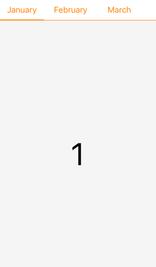
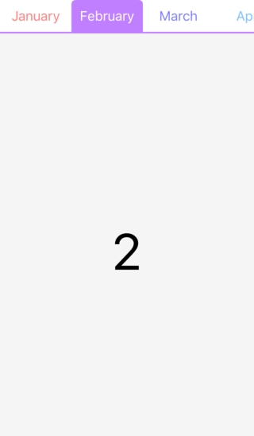

PageMenuController
===========

日本のニュース系アプリで使われている横スクロールのメニュー画面とそのコンテンツを表示するユーザインタフェースのクラスを実装。Xcode のプロジェクト一式を登録してあるので、実行すればシミュレータ上で動作確認が可能。

横スクロールするメニューは UIScrollView を利用し、タイトル表示用の UILabel を管理している。コンテンツ表示部は UIPageViewController を使って画面を切り替えている。とてもシンプルな実装なので、必要に応じて自分で改良してね。

Screenshot
============

**NewsPass っぽい画面（PMKPageMenuControllerStylePlain）**



Xcode の Edit Scheme... の Build Configuration の "Debug (Plain)" を選択してビルド。

**Gnunosy っぽい画面（PMKPageMenuControllerStyleTab）**



Xcode の Edit Scheme... の Build Configuration の "Debug (Tab)" を選択してビルド。

**SmartNews っぽい画面（PMKPageMenuControllerStyleSmartTab）**


Xcode の Edit Scheme... の Build Configuration の "Debug (Smart)" を選択してビルド。

How to use PageMenuController
============

**1) PageMenuController フォルダの PSKPageMenuController.h と PSKPageMenuController.m ファイルを Xcode のプロジェクトにコピーする。**

**2) ベースとする View Controller に property を記述する。**

```objectivec
@property (nonatomic,strong) PMKPageMenuController * pageMenuController;
```

**3) 次のコードを loadView (or viewDidLoad) に記述する。**

```objectivec
// UIViewController のサブクラスを管理する配列
NSMutableArray * controllers = [NSMutableArray new];

// 以下のような感じで必要な UIViewController を追加する
UIViewController * vc = [UIViewController new];
vc.title = @"Page Title"; // このタイトルがメニューに表示されるよ
[controllers addObject:vc];

// ステータスバーの高さを求める
CGFloat statusBarHeight = [UIApplication sharedApplication].statusBarFrame.size.height;

// SmartNews っぽい見た目にする
PMKPageMenuControllerStyle menuStyle = PMKPageMenuControllerStyleSmartTab;

// 必要な引数を渡して PageMenuController を初期化
PMKPageMenuController * pageMenuController;
pageMenuController = [[PMKPageMenuController alloc]
                       initWithControllers:controllers
                       menuStyle:menuStyle
                       topBarHeight:statusBarHeight];

// PageMenuController を親となる ViewController の ChildViewController とする
// 以下は PMKPageMenuController を利用するときには必須のコード
[self addChildViewController:pageMenuController];
[self.view addSubview:pageMenuController.view];
[pageMenuController didMoveToParentViewController:self];
self.pageMenuController = pageMenuController;
```
より詳細なコードは RootViewController.m 内の loadView を見てね。

Requirements
============

 - ARC
 - Objective-C
 - iOS 10.x
 - Xcode 8.x

License Agreement
============

Copyright (c) 2016, Kouichi ABE (WALL) All rights reserved.

Redistribution and use in source and binary forms, with or without
modification, are permitted provided that the following conditions are met:

 1. Redistributions of source code must retain the above copyright notice,
    this list of conditions and the following disclaimer.

 2. Redistributions in binary form must reproduce the above copyright notice,
    this list of conditions and the following disclaimer in the documentation
    and/or other materials provided with the distribution.

THIS SOFTWARE IS PROVIDED BY THE COPYRIGHT HOLDERS AND CONTRIBUTORS "AS IS"
AND ANY EXPRESS OR IMPLIED WARRANTIES, INCLUDING, BUT NOT LIMITED TO, THE
IMPLIED WARRANTIES OF MERCHANTABILITY AND FITNESS FOR A PARTICULAR PURPOSE ARE
DISCLAIMED. IN NO EVENT SHALL THE COPYRIGHT HOLDER OR CONTRIBUTORS BE LIABLE
FOR ANY DIRECT, INDIRECT, INCIDENTAL, SPECIAL, EXEMPLARY, OR CONSEQUENTIAL
DAMAGES (INCLUDING, BUT NOT LIMITED TO, PROCUREMENT OF SUBSTITUTE GOODS OR
SERVICES; LOSS OF USE, DATA, OR PROFITS; OR BUSINESS INTERRUPTION) HOWEVER
CAUSED AND ON ANY THEORY OF LIABILITY, WHETHER IN CONTRACT, STRICT LIABILITY,
OR TORT (INCLUDING NEGLIGENCE OR OTHERWISE) ARISING IN ANY WAY OUT OF THE USE
OF THIS SOFTWARE, EVEN IF ADVISED OF THE POSSIBILITY OF SUCH DAMAGE.
